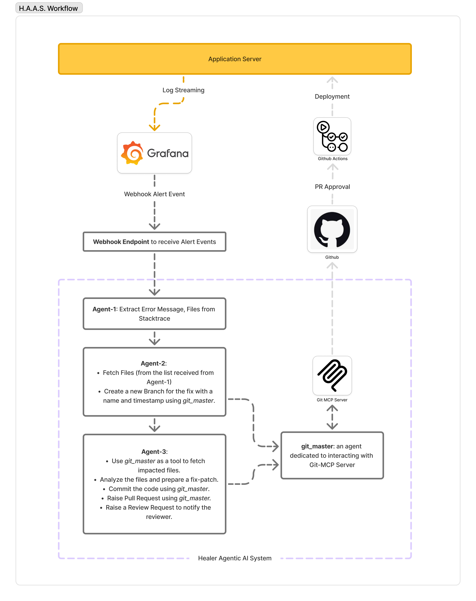

# proj_healer
A Multi-agent AI system that works on the production issues with a webhook connectivity to your observability stack.

## Local Setup
 To run this project you need three main [Docker Server](https://docs.docker.com/desktop/) ([OrbStack](https://docs.orbstack.dev/quick-start) is a lightweight alternative), [github-mcp-server](https://github.com/github/github-mcp-server/blob/main/README.md) local and [uv](https://docs.astral.sh/uv/).

### After installing these three, follow the steps below:
1. __Setup Local Github-MCP-Server__
- ```bash
    docker image pull ghcr.io/github/github-mcp-server
2. Clone this repository
- ```bash
    git clone git@github.com:atulGupta2922/proj_healer.git
3. Install dependencies using uv
- ```bash
    cd proj_healer
    uv sync
4. Serve the FastAPI ASGI server
- ```bash
    cd src
    uv run uvicorn app.main:app --reload
5. Visit http://localhost:8000 & http://localhost:8000/docs (OpenAPI doc)

## System Workflow Overview



